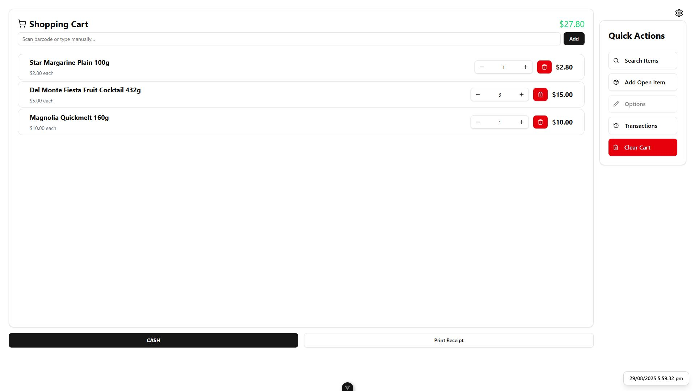

# Cabalen Groceries POS System

A modern, cross-platform Point of Sale (POS) application built with Tauri, Vue.js, and Rust.
Designed for speed, reliability, and direct hardware communication for receipt printing.



## Features

- **Intuitive Shopping Cart**: Easily add, edit, and remove items from the cart.
- **Barcode Scanning Support**: Quickly add products by scanning their barcodes.
- **Product Management**: A comprehensive interface to search, create, and update product
  information in the database.
- **Transaction History**: View and reprint receipts from past transactions.
- **Direct Receipt Printing**: Utilizes the `escpos-rs` crate to communicate directly with thermal
  receipt printers for fast and reliable printing.
- **Cross-Platform**: Built with Tauri to run natively on Windows, macOS, and Linux.

## Tech Stack

- **Backend Framework**: [Tauri](https://tauri.app/)
- **Backend Language**: [Rust](https://www.rust-lang.org/)
- **Frontend Framework**: [Vue.js 3](https://vuejs.org/) (with Composition API)
- **Frontend Language**: [TypeScript](https://www.typescriptlang.org/)
- **Database**: SQLite via the `@tauri-apps/plugin-sql` plugin.
- **Printer Communication**: [escpos-rs](https://crates.io/crates/escpos) Rust crate for direct
  ESC/POS commands.
- **UI Components**: [shadcn-vue](https://www.shadcn-vue.com/)
- **Runtime & Package Manager**: [Bun](https://bun.sh/)

## Prerequisites

Before you begin, ensure you have the following installed on your system:

- **Rust Toolchain**: Install via [rustup](https://rustup.rs/).
- **Node.js & Bun**: [Install Bun](https://bun.sh/docs/installation).
- **System Dependencies**: Follow the
  [Tauri prerequisites guide](https://tauri.app/v1/guides/getting-started/prerequisites) for your
  specific operating system.
  - **Windows**: Microsoft C++ Build Tools and the WiX Toolset are required.
  - **macOS**: Xcode Command Line Tools are required.
  - **Linux**: `build-essential`, `libwebkit2gtk-4.0-dev`, and other dependencies are required.

## Getting Started

Follow these steps to get the development environment running on your local machine.

1.  **Clone the repository:**

    ```bash
    git clone https://github.com/francis1009/pos-system-tauri.git
    cd pos-system-tauri
    ```

2.  **Install frontend dependencies:**

    ```bash
    bun install
    ```

3.  **Hardware Setup (Receipt Printer - Direct USB via Zadig)**

    This application communicates with the printer using low-level USB commands via the `rusb`
    library. By default, Windows assigns a standard printer driver that "locks" the device,
    preventing this kind of direct access. To fix this, we must replace the default driver with a
    generic `WinUSB` driver using the Zadig utility.

    > **IMPORTANT WARNING:** This process will dedicate the printer to be used **only** by this POS
    > application. It will no longer be available for printing from other standard Windows programs
    > like Notepad or a web browser. This is typically the desired behavior for a dedicated POS
    > terminal.

    #### Step 1: Find Your Printer's VID & PID

    - Connect your printer via USB and turn it on.
    - Open **Device Manager** in Windows.
    - Locate your printer. It may be under "Printers", "Print queues", or "Universal Serial Bus
      devices".
    - Right-click the printer and select **Properties**.
    - Go to the **Details** tab and select **"Hardware Ids"** from the dropdown.
    - Note the `VID` and `PID` values. For example, in `USB\VID_0483&PID_5840`, the VID is `0483`
      and the PID is `5840`.

    #### Step 2: Replace the Driver with Zadig

    - Download the latest version of **[Zadig](https://zadig.akeo.ie/)**.
    - Right-click `zadig.exe` and **"Run as administrator"**.
    - In the Zadig menu, go to **Options** and check **"List All Devices"**. This is a crucial step.
    - Find and select your printer from the main dropdown list. **Verify that the USB ID (VID & PID)
      matches what you found in Step 1.**
    - In the target driver box (the one on the right), select **WinUSB**.
    - Click the **"Replace Driver"** button and wait for the process to complete.

    #### Step 3: Configure the Application

    - Open the `src-tauri/src/printer.rs` file.
    - Update the const `PRINTER_VID` and `PRINTER_PID` with the VID and PID you found. Remember to prefix
      the hexadecimal values with `0x`.

    ```rust
    // src-tauri/src/printer.rs

    // Replace these example values with your printer's actual VID and PID
    pub const PRINTER_VID: u16 = 0x0483;
    pub const PRINTER_PID: u16 = 0x5840;
    ```

4.  **Run the application in development mode:** This command will open the application in a
    development window with hot-reloading enabled.
    ```bash
    bun tauri dev
    ```

## Building for Production

To build the application and generate a native installer (`.msi` on Windows, `.dmg` on macOS), run
the following command:

```bash
bun tauri build
```

The installer will be located in the `src-tauri/target/release/bundle/` directory.
